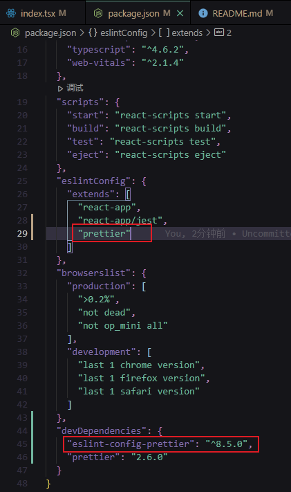
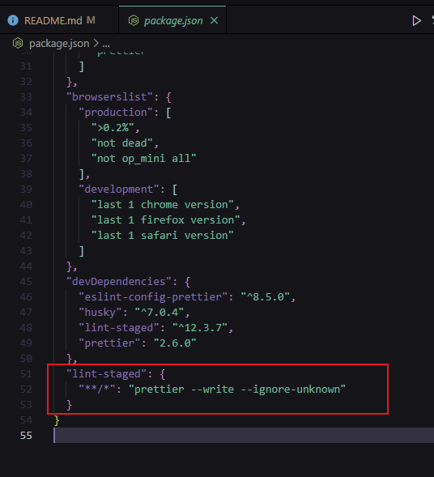
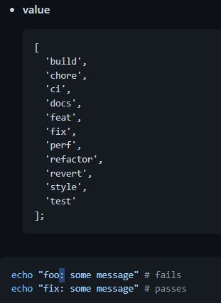
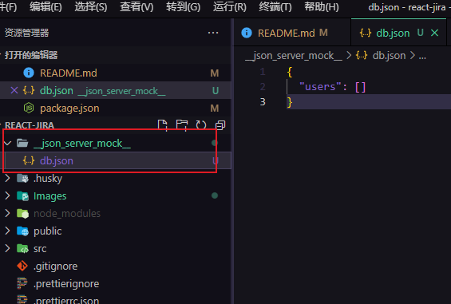
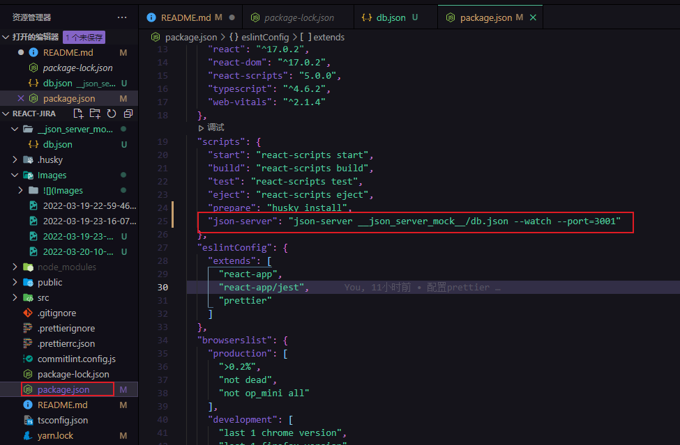
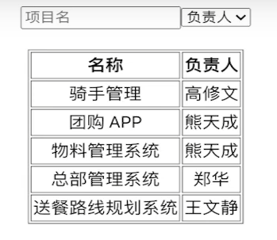
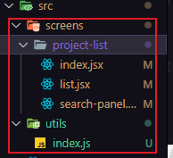
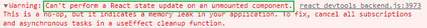
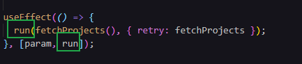
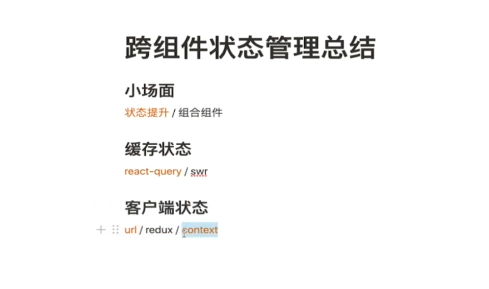

# react-jira

# 初始化项目

`npx create-react-app my-app --template typescript`

# 项目配置

## 绝对路径使用配置

```js
// tsconfig.json
"baseUrl": "./src"
```

## [配置 prettier](https://prettier.io/docs/en/install.html)

`yarn add --dev --exact prettier`

`echo {}> .prettierrc.json`

创建`.prettierignore`文件

处理和 ESLint 的冲突：

`yarn add --dev eslint-config-prettier`



Git hooks:

```js
yarn add --dev husky lint-staged

npx husky install
npm set-script prepare "husky install"
npx husky add .husky/pre-commit "npx lint-staged"

```



## 配置 commitlint

```js
yarn add --dev @commitlint/config-conventional @commitlint/cli

echo "module.exports = {extends: ['@commitlint/config-conventional']}" > commitlint.config.js

yarn husky add .husky/commit-msg 'yarn commitlint --edit $1'
```



# 常见 Mock 方案

## 代码入侵（直接在代码中写死 Mock 数据，或者请求本地的 JSON 文件）

- 优点：无
- 缺点
  - 和其它方案比 Mock 效果不好
  - 与真实 Server 环境的切换非常麻烦，一切需要侵入代码切换环境的行为都是不好的

## 请求拦截

代表：Mock.js

- 优点：

  - 与前端代码分离
  - 可生成随机数据

- 缺点：
  - 数据都是动态生成的假数据，无法真实模拟增删改查的情况
  - 只支持 ajax，不支持 fetch

## 接口管理工具

代表：rap，swagger，moco，yapi

- 优点：

  - 配置功能强大，接口管理与 Mock 一体，后端修改接口 Mock 也跟着更改，可靠

- 缺点：
  - 配置复杂，依赖后端，可能会出现后端不愿意出手，或者等配置完了，接口也开发出来了的情况
  - 一般会作为大团队的基础建设而存在，没有这个条件的话慎重考虑

## 本地 node 服务器（本项目采用）

代表：json-server

- 优点：

  - 配置简单，json-server 甚至可以 0 代码 30 秒启动一个 REST API Server
  - 自定义程度高，一切尽在掌控中
  - 增删改查真实模拟

- 缺点：
  - 与接口管理工具相比，无法随着后端 API 的修改而自动修改

> REST API
>
> 一句话总结：URI 代表 资源/对象，METHOD 代表行为
>
> ```js
> GET / tickets; // 列表
> GET / tickets / 12; // 详情
> POST / tickets; // 增加
> PUT / tickets / 12; // 替换
> PATCH / tickets / 12; // 修改
> DELETE / tickets / 12; // 删除
> ```

### [配置 json-server](https://github.com/typicode/json-server)

```js
yarn add json-server -D
```



在 package.json 中添加启动命令：



# React 列表数据获取与渲染-工程列表



状态提升：将子组件中的状态提升到父组件中



用于处理传入 param 参数：`yarn add qs`

# 用 Custom Hook 提取并复用组件代码

Custom Hook 是 React 中最新也是最优秀的组件代码复用方案

我们已经认识过了`useState`和`useEffect`两个最近本的 React 自带 Hook，本节我们将会写出`useMount`和`useDebounce`两个 Custom Hook，体会它是怎么像函数一样提取组件逻辑的

## 自定义 Hook，用 useDebounce 减少工程搜索请求频率

# 引入 TypeScript

使用 JS 时，大部分的错误都是在 runtime（运行时）的时候发现的

我们希望，在静态代码中，就能找到其中的一些错误 -> 强类型

# 安装开发者工具

`npx imooc-jira-tool`

# TS 的联合类型，Partial,Omit,Pick 和 Exclude

# CSS in JS 方案之一：Emotion 的安装与使用

`yarn add @emotion/react @emotion/styled`

# 安装 react-router 和 react-router-dom

`yarn add react-router react-router-dom`

# useState 和 useRef

# Can't perform a React state update on an unmounted component 错误



原因，进行异步操作的时候，未等操作返回结果就卸载了组件

# 无限循环可能原因之一

将非状态变量写在了 useEffect 的依赖参数中



# useCallback

只有当 useCallback 中的依赖变化时才会重新定义

# 组件组合(component composition)

如果你只是想避免层层传递一些属性，组件组合（component composition）有时候是一个比 context 更好的解决方案

# useReducer

# React Query

类似的还有 SWR

`yarn add react-query`

# 跨组件状态管理总结


